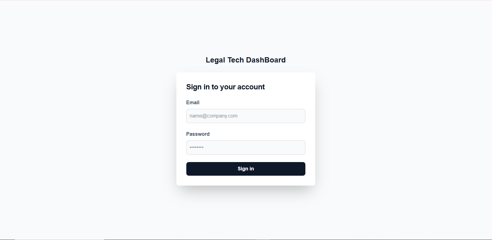
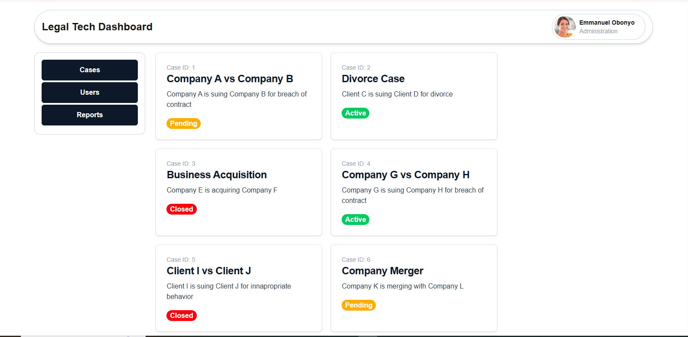
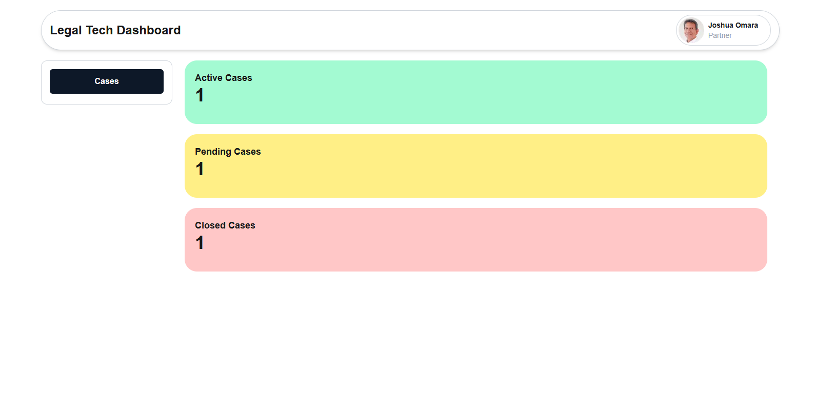

## Live Demo

https://legal-tech-dashboard.vercel.app/

## Short Video Walk Through

https://www.loom.com/share/6bd548e1277749ae950380b0de2f5594?sid=00253771-4981-4729-a50f-cf5dd611f7a5

## App Screen Shots

- Login Screen

  

- Admin Dashboard

  

- Standard Dashboard

  

## Built With

- NextJS, Redux, TailwindCSS, MaterialUI Icons.
- Jest (Testing)

# Set Up

## Clone This Repository

```
$ git clone https://github.com/emmyobonyo/Legal-Tech-Dashboard.git
$ cd Legal-Tech-Dashboard
```

## Run Project

```
$ npm install
$ npm run dev
$ npm test (testing)
```

## User Credentials

```
Admin:
- email: emmanuelobonyo@legaltech.com
- password: adminpassword

Standard:
- email: joshuaomara@legaltech.com
- password: standardpassword

More standard users om `app/lib/apis/data/mockUsers.ts`
```

## Branches

- **main**: Final working code (default branch)
- **login-form**: Authentication functionality
- **admin-dashboard**: Admin dashboard features
- **standard-dashboard**: Standard user dashboard features

## Techincal Decisions

- **Displaying Information using State**: When an Admin redirects to another page, global state is changed, and the component that is displayed is dependent on that state.
- **Conditinally rendering the dashboard**: The Dashboard that is rendered is dependent on `User role`. Admin Users (emmanuelobonyo@legaltech.com) will see the Admin Dashboard and Standard Users will see the standard Dashboard.
- **API state managed by Redux**: `Pending`, `Fullfilled` and `Rejected` States are managed in Redux

## 🤝 Contributing

Feedback, contributions, issues, and feature requests are welcome!

Feel free to check the [issues page](https://github.com/emmyobonyo/Legal-Tech-Dashboard/issues).
